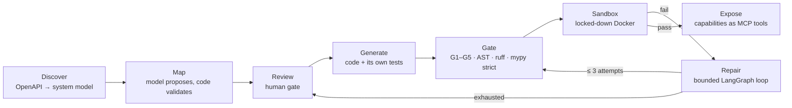
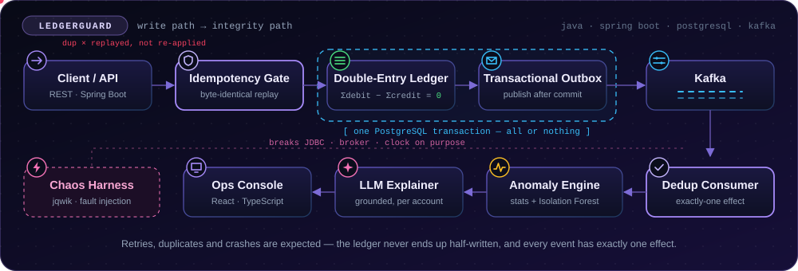

<!-- ════════════════════════════════════  HERO  ════════════════════════════════════ -->
<div align="center">



<a href="https://git.io/typing-svg"></a>

<a href="https://vahini-dev.vercel.app/"></a>
<a href="https://www.linkedin.com/in/venkata-vahini-chilukamarri-2b5064314/"></a>
<a href="mailto:vahinivenkatac@gmail.com"></a>


<br/><br/>

### Verified, not trusted.
<sub>Every agent I build proposes — deterministic code decides.</sub>

</div>

<br/>

<!-- ════════════════════════════════════  WHOAMI  ════════════════════════════════════ -->
<table>
<tr>
<td width="56%" valign="top">

```java
@Engineer
public final class Vahini {

    String   name     = "Venkata Vahini Chilukamarri";
    String   school   = "KMIT · B.Tech CSE '27 · CGPA 9.12";
    String   recent   = "Salesforce Mentorship '26 · SWE Mentee";
    String   research = "AgentShield AI · accepted, Jan 2027";

    String[] builds   = { "LLM agents", "payment ledgers",
                          "eval pipelines", "observability tooling" };
    String[] believes = { "agents propose, code decides",
                          "tests that break things",
                          "negative results stay in" };

    Result ship(Idea idea) {
        return idea.design()
                   .test()
                   .breakOnPurpose()   // jqwik + fault injection
                   .gate()             // policy before execution
                   .deploy();
    }
}
```

</td>
<td width="44%" valign="top">

### ⚡ What I do

Final-year CSE at KMIT building **AI systems that are verified, not trusted** — agents that ship their own test suites, payment agents fenced by deterministic policy, and ledgers proven with property-based tests.

Most of my work sits where **LLM agents, testing and distributed systems** meet.

### 🛠️ Now building
**MORPH v0.6** — MCP policy layer

### 🎯 Open to
**Software Engineering · AI/ML** internships

</td>
</tr>
</table>

<!-- ════════════════════════════════════  NUMBERS  ════════════════════════════════════ -->
<div align="center">

| 🎓 **9.12** | 📈 **+42%** | 📄 **1** | 🧪 **38 / 15** |
|:---:|:---:|:---:|:---:|
| <sub>CGPA · B.Tech CSE, KMIT</sub> | <sub>more revenue recovered than a rules baseline (TRACE, 300 cases)</sub> | <sub>accepted research paper · AgentShield AI, Jan 2027</sub> | <sub>property tests / fault injections guarding LedgerGuard</sub> |

</div>

<!-- ════════════════════════════════════  EXPERIENCE  ════════════════════════════════════ -->


<table>
<tr>
<td width="140" align="center" valign="top">
<br/>
<sub><b>Jun – Aug 2026</b><br/>Remote</sub>
</td>
<td valign="top">

#### Software Engineering Mentee — Salesforce Mentorship Program
**Microservice Health & API Performance Orchestrator**

- 🕸️ **Dependency-graph engine** that auto-discovers service dependencies from **OpenTelemetry** trace spans, using **Tarjan's SCC** to detect and collapse circular dependencies before analysis
- 🎯 **Root-cause analysis** combining topological root-finding with time-correlation ranking, plus cycle-safe BFS/DFS **blast-radius** computation to predict cascading failures
- 🔔 **Deduplicated Slack/Discord alerting** with flap suppression and retry/fallback logging, backed by a SQLite incident store and a live **Cytoscape.js** dependency dashboard

`FastAPI` `OpenTelemetry` `SQLite` `Cytoscape.js` `Slack API` `Graph Algorithms`

</td>
</tr>
<tr>
<td width="140" align="center" valign="top">
<br/>
<sub><b>To appear<br/>Jan 2027</b></sub>
</td>
<td valign="top">

#### 🛡️ AgentShield AI — Co-author
**Multi-agent LLMs for cloud infrastructure security**

- Extends LLM-based IaC vulnerability remediation from **AWS-only to Azure and GCP** across Terraform, Kubernetes and Helm
- An **8-agent LangGraph pipeline** over Checkov, tfsec and KICS scans with RAG retrieval
- Patches validated in a **LocalStack sandbox**; Claude / GPT-4o **ensemble voting** routes low-confidence fixes to human review

`Python` `LangGraph` `RAG` `FastAPI` `Checkov` `tfsec` `KICS` `LocalStack`

<sub>📎 Preprint link coming soon</sub>

</td>
</tr>
</table>

<!-- ════════════════════════════════════  FLAGSHIP PROJECTS  ════════════════════════════════════ -->


### 🧬 MORPH — Autonomous AI Integration Engineer &nbsp;
> *Agent-written integration code — verified, not trusted.*

Given two independently built systems' API contracts, MORPH discovers their schemas, proposes how the data maps, writes the integration — and pairs **every generated module with a generated test suite**, run inside a locked-down sandbox.



<table>
<tr>
<td width="25%" align="center"><b>≤ 3</b><br/><sub>bounded repairs, then a human</sub></td>
<td width="25%" align="center"><b>5</b><br/><sub>guards that never loosen</sub></td>
<td width="25%" align="center"><b>413</b><br/><sub>hidden oracle checks</sub></td>
<td width="25%" align="center"><b>60 s</b><br/><sub>sandbox time limit</sub></td>
</tr>
</table>

**Honest by design** — correctness is judged by a hand-written oracle the pipeline never sees. A run that passes every gate MORPH controls can still fail the oracle, and that gets reported. Conditions that never reached READY stay in every denominator, and a source-level test forbids the repair loop from importing oracle code.

`Python` `FastAPI` `LangGraph` `MCP` `PostgreSQL` `pgvector` `Docker` `Groq` `Ollama`

<!-- TODO: replace the link below with the MORPH repo URL -->
<a href="https://github.com/vahinichilukamarri"></a>

<br/><br/>

### 🧠 TRACE — Transaction Recovery Agent with Contextual Evaluation &nbsp;
> *A failed payment isn't a lost customer — and an agent shouldn't get the last word.*



TRACE decides whether a failed payment is worth recovering, picks the single best next action, executes it, adapts to the outcome — and knows when to stop. Built for the **Razorpay AI Buildathon**.

- 📈 Benchmarked against a fixed-rules baseline on **300 synthetic failed transactions**: **+42% revenue recovered** at a **23% higher relative recovery rate** on identical data
- ⚙️ **Dual-engine design** — a free deterministic heuristic scores every case; the LLM (Groq) is called only when one of four uncertainty signals fires
- 🛡️ A **9-rule, 100% deterministic policy layer** approves, blocks or flags every recommendation before execution; LLM timeouts fall back to a safe, flagged state

`React` `FastAPI` `SQLAlchemy` `Groq LLM` `PostgreSQL` `Vercel` `Render`

<a href="https://trace-xi-nine.vercel.app/"></a>
<a href="https://github.com/vahinichilukamarri/TRACE"></a>

<br/><br/>

### 🏦 LedgerGuard — Payment Integrity Platform
> *A ledger that refuses to be wrong — even when the network, the database and the clock all fail.*



Built in **14 locked, tagged phases** — enforcing that debits equal credits for every transaction before it's persisted, then independently verifying, stress-testing and explaining anything that looks wrong.

<table>
<tr>
<td width="33%" valign="top">

**💰 Can't go unbalanced**<br/>
Double-entry invariant validated **per currency inside the same transaction** as the write — no half-committed unbalanced state is ever visible.

</td>
<td width="33%" valign="top">

**🔁 Exactly one effect**<br/>
Idempotency keys with **byte-identical replay** under concurrent duplicates; events published to Kafka via a **transactional outbox**.

</td>
<td width="33%" valign="top">

**💥 Broken on purpose**<br/>
**38 property-based tests** (jqwik) plus **15 deterministic fault injections** at the JDBC, broker and clock seams.

</td>
</tr>
</table>

Statistical + Isolation-Forest anomaly detection with grounded LLM explanations, scored against labelled data, and a React/TypeScript ops console over the whole system.

`Java` `Spring Boot` `PostgreSQL` `Kafka` `Flyway` `jqwik` `Testcontainers` `React` `TypeScript`

<a href="https://github.com/vahinichilukamarri/LedgerGuard"></a>

<!-- ════════════════════════════════════  MORE PROJECTS  ════════════════════════════════════ -->


<table>
<tr>
<td width="50%" valign="top">

### ⚙️ EvalEngine
**LLM Evaluation & Improvement Engine**

Modular **LLM-as-a-judge** pipeline that generates, scores and ranks AI responses across several metrics, then feeds results back as **refinement signals** — surfaced in an interactive Streamlit dashboard.

`Python` `Streamlit` `LLM APIs` `RAG`

<a href="https://github.com/vahinichilukamarri/llm-evaluation-engine"></a>

</td>
<td width="50%" valign="top">

### 🧩 AskBI
**Plain-English Business Intelligence**

End-to-end **natural-language → SQL** pipeline: non-technical users query CSV data in plain English and get real-time visual insights — no SQL required.

`React` `FastAPI` `Pandas` `LLM APIs` `SQL`

<a href="https://github.com/vahinichilukamarri/AskBI"></a>

</td>
</tr>
<tr>
<td width="50%" valign="top">

### 🛣️ SafeStreet
**Vision-Transformer Road Damage Detection**

A **Vision Transformer** classifies 4 road-damage types at **90%+ accuracy**; a mobile app geotags each report and auto-alerts the authorities — cutting manual work by ~40%.

`Vision Transformer` `React Native` `Node.js` `REST API`

<!-- TODO: replace the link below with the SafeStreet repo URL -->
<a href="https://github.com/vahinichilukamarri"></a>

</td>
<td width="50%" valign="top">

### 🧠 MoodAngels
**AI-Based Psychiatric Diagnostic Support**

**Multi-agent** system that analyses symptoms and behavioural indicators; Pearson-correlation analysis improved diagnostic accuracy **~25%** over a rule-based baseline on 500+ synthetic records.

`Multi-Agent AI` `NLP` `Python` `MERN Stack`

<a href="https://github.com/AnishaPaturi/Mood-Angles"></a>

</td>
</tr>
</table>

<!-- ════════════════════════════════════  HOW I BUILD  ════════════════════════════════════ -->


<table>
<tr>
<td width="25%" align="center" valign="top">

### 🧭
**Agents propose, code decides**<br/>
<sub>Bounded action sets and deterministic policy layers that can veto the model before anything runs.</sub>

</td>
<td width="25%" align="center" valign="top">

### 🧪
**AI code ships with its tests**<br/>
<sub>Generated modules come with generated test suites, gated and run in a sandbox.</sub>

</td>
<td width="25%" align="center" valign="top">

### 💥
**Break it before prod does**<br/>
<sub>Property-based tests and fault injection across the DB, the broker and the clock.</sub>

</td>
<td width="25%" align="center" valign="top">

### 📏
**Negative results stay in**<br/>
<sub>Hidden oracles and honest denominators — a pipeline shouldn't grade itself.</sub>

</td>
</tr>
</table>

<!-- ════════════════════════════════════  STACK  ════════════════════════════════════ -->


<div align="center">

<table>
<tr><td align="center" width="150"><b>💻 Languages</b></td><td>

</td></tr>
<tr><td align="center"><b>🧠 AI & LLMs</b></td><td>


<br/>


</td></tr>
<tr><td align="center"><b>⚙️ Backend & Web</b></td><td>


</td></tr>
<tr><td align="center"><b>🗄️ Data</b></td><td>


</td></tr>
<tr><td align="center"><b>🧪 Testing & Ops</b></td><td>


</td></tr>
</table>

</div>

<!-- ════════════════════════════════════  STATS  ════════════════════════════════════ -->


<div align="center">


</div>

## 🐍 Watch My Contributions Get Eaten!

<div align="center">

<picture>
  <source media="(prefers-color-scheme: dark)" srcset="https://raw.githubusercontent.com/vahinichilukamarri/vahinichilukamarri/output/github-contribution-grid-snake-dark.svg">
  <source media="(prefers-color-scheme: light)" srcset="https://raw.githubusercontent.com/vahinichilukamarri/vahinichilukamarri/output/github-contribution-grid-snake.svg">
  
</picture>

</div>

<!-- ════════════════════════════════════  ACHIEVEMENTS  ════════════════════════════════════ -->


<div align="center">

| | | |
|:---:|:---:|:---:|
| 🥇<br/>**Centific Premier Hackathon 2.0**<br/><sub>Winner · AI recruiter avatar platform built in 2 weeks · AI Engineer internship offer</sub> | 📄<br/>**AgentShield AI**<br/><sub>Co-author · accepted, to appear Jan 2027</sub> | ☁️<br/>**Salesforce Mentorship**<br/><sub>SWE Mentee · Summer 2026</sub> |
| 🎓<br/>**9.12 CGPA**<br/><sub>B.Tech CSE @ KMIT · 2023–2027</sub> | 📐<br/>**97.0% Intermediate**<br/><sub>Top 3% statewide (MPC)</sub> | 🚀<br/>**PRAKALP & GfG Hackathons**<br/><sub>Bluetooth Talking Vehicle · end-to-end prototype</sub> |
| 📜<br/>**SQL (Intermediate)**<br/><sub>HackerRank Certified</sub> | 🤖<br/>**Generative AI for Beginners**<br/><sub>GreatLearning Certified</sub> | 🔬<br/>**Generative AI Workshop**<br/><sub>Skilligence EdTech × IIT Hyderabad</sub> |

</div>

<!-- ════════════════════════════════════  BEYOND THE CODE  ════════════════════════════════════ -->


<table>
<tr>
<td width="25%" align="center" valign="top">

### 👩‍💻
**Rewriting the Code**<br/>
<sub>Contributor to a nonprofit supporting women in tech · Jun 2026 – now</sub>

</td>
<td width="25%" align="center" valign="top">

### 🛠️
**DBMS Workshop**<br/>
<sub>Led a peer technical workshop on database systems at KMIT</sub>

</td>
<td width="25%" align="center" valign="top">

### 🫂
**NSS Volunteer**<br/>
<sub>5+ service drives · 40+ volunteer hours · since 2023</sub>

</td>
<td width="25%" align="center" valign="top">

### 🎨
**Graphic Designer Intern**<br/>
<sub>KMIT Student Council PR · 20+ assets, 2,000+ reach</sub>

</td>
</tr>
</table>

<!-- ════════════════════════════════════  FOOTER  ════════════════════════════════════ -->
<br/>

<div align="center">

### 💌 Let's build something real.
<sub>Looking for Software Engineering or AI/ML internships — or just say hi.</sub>

<br/><br/>

<a href="https://vahini-dev.vercel.app/"></a>
<a href="https://www.linkedin.com/in/venkata-vahini-chilukamarri-2b5064314/"></a>
<a href="mailto:vahinivenkatac@gmail.com"></a>
<a href="https://github.com/vahinichilukamarri"></a>


</div>
