<!-- ════════════════════════════════════  HERO  ════════════════════════════════════ -->
<div align="center">


<a href="https://git.io/typing-svg"></a>

<a href="https://vahini-dev.vercel.app/"></a>
<a href="https://www.linkedin.com/in/venkata-vahini-chilukamarri-2b5064314/"></a>
<a href="mailto:vahinivenkatac@gmail.com"></a>


</div>

<br/>

<!-- ════════════════════════════════════  WHOAMI  ════════════════════════════════════ -->
<table>
<tr>
<td width="56%" valign="top">

```java
@Engineer
public final class Vahini {

    String   name    = "Venkata Vahini Chilukamarri";
    String   school  = "KMIT · B.Tech CSE '27 · CGPA 9.12";
    String   recent  = "Salesforce Mentorship '26 · SWE Mentee";

    String[] builds  = { "payment ledgers", "AI agents",
                         "observability tooling", "vision models" };
    String[] obsess  = { "idempotency", "failure modes",
                         "tests that break things" };

    Result ship(Idea idea) {
        return idea.design()
                   .test()
                   .breakOnPurpose()   // jqwik + fault injection
                   .fix()
                   .deploy();
    }
}
```

</td>
<td width="44%" valign="top">

### ⚡ What I do

I build **backend and AI systems that stay correct when things go wrong** — retries, duplicates, crashes, flaky LLMs.

Java + Spring Boot for the parts that must never lose money. Python + FastAPI for the parts that think.

### 🎯 Open to
**SWE · Backend · AI Engineering** roles where reliability actually matters.

### 💬 Ask me about
Transactional outbox · idempotency keys · bounded LLM agents · Tarjan's SCC on trace spans · Vision Transformers

</td>
</tr>
</table>



<!-- ════════════════════════════════════  EXPERIENCE  ════════════════════════════════════ -->


<table>
<tr>
<td width="130" align="center" valign="top">
<br/>
<sub><b>Jun – Aug 2026</b><br/>Remote</sub>
</td>
<td valign="top">

#### Software Engineering Mentee — Salesforce Mentorship Program
**Microservice Health & API Performance Orchestrator**

- 🕸️ **Dependency graph engine** that auto-discovers service dependencies from **OpenTelemetry** trace spans, then runs **Tarjan's SCC** to detect and collapse circular dependencies
- 🎯 **Root-cause analysis** that ranks likely culprits via topological root-finding + time-correlation across services, with cycle-safe BFS/DFS to estimate **blast radius**
- 🔔 **Slack / Discord alerting** that suppresses duplicate and flapping alerts, retries with SQLite-backed fallback logging, and a live **Cytoscape.js** dependency dashboard

`OpenTelemetry` `Graph Algorithms` `SQLite` `Cytoscape.js` `Slack/Discord APIs`

</td>
</tr>
</table>

<!-- ════════════════════════════════════  FLAGSHIP PROJECTS  ════════════════════════════════════ -->


### 🏦 LedgerGuard — Payment Integrity Platform
> *A ledger that refuses to be wrong — even when the network, the database and the clock all fail.*


<table>
<tr>
<td width="33%" valign="top">

**💰 Can't go unbalanced**<br/>
Double-entry validation runs **per currency inside the same transaction** as the write — an unbalanced transaction can never be partially persisted.

</td>
<td width="33%" valign="top">

**🔁 Exactly one effect**<br/>
Required idempotency keys with **byte-identical replay**, a **transactional outbox** that publishes to Kafka only after commit, and consumer-side dedup.

</td>
<td width="33%" valign="top">

**🔎 Explains its alarms**<br/>
Statistical + **Isolation-Forest** anomaly detection with per-feature attribution and a **grounded LLM explanation** per flagged account, scored by a precision/recall harness.

</td>
</tr>
</table>

Verified end-to-end with **jqwik property tests** and **deterministic fault injection** across JDBC, broker and clock seams, plus a React/TypeScript ops console over the whole system.

`Java` `Spring Boot` `PostgreSQL` `Kafka` `Flyway` `jqwik` `Testcontainers` `React` `TypeScript`

<!-- TODO: replace the link below with the LedgerGuard repo URL -->
<a href="https://github.com/vahinichilukamarri"></a>

<br/><br/>

### 🧠 TRACE — Transaction Recovery Agent with Contextual Evaluation
> *An AI agent for failed payments that's smart enough to adapt and disciplined enough to stay in bounds.*


- 🎛️ The agent picks recovery actions from a **controlled option set**, in a **bounded reassessment loop** that learns from prior outcomes without runaway execution
- 🛡️ An **independent policy layer** approves, blocks or flags every recommendation before anything runs
- 📈 Benchmarked against a fixed-rules baseline on **300 synthetic failed transactions**: **42% more revenue recovered** and a **23% higher relative recovery rate** on identical data
- 🧯 Idempotency protection for repeated payment events, and automatic **fallback to a safe/flagged state** when LLM classification times out or fails

`Python` `FastAPI` `React` `LLM APIs` `Agent Design`

<!-- TODO: replace the two links below with the TRACE live-demo and repo URLs -->
<a href="https://github.com/vahinichilukamarri"></a>
<a href="https://github.com/vahinichilukamarri"></a>

<!-- ════════════════════════════════════  MORE PROJECTS  ════════════════════════════════════ -->


<table>
<tr>
<td width="50%" valign="top">

### ⚙️ EvalEngine
**LLM Evaluation & Improvement System**

Modular **LLM-as-a-judge** pipeline that generates, scores and ranks AI responses across several metrics, then feeds the results back as **refinement signals** — shown in an interactive Streamlit dashboard.

🔁 Feedback refinement loop · 🔍 RAG *(in progress)*

`Python` `Streamlit` `LLM APIs` `RAG`

<a href="https://github.com/vahinichilukamarri/llm-evaluation-engine"></a>

</td>
<td width="50%" valign="top">

### 🧩 AskBI
**AI Business Intelligence Dashboard**

End-to-end **natural-language → SQL** pipeline: non-technical users query CSV data in plain English and get real-time visual insights — no SQL required.

💬 Natural language → SQL · 📊 Real-time viz

`React` `FastAPI` `Pandas` `LLM APIs` `SQL`

<a href="https://github.com/vahinichilukamarri/AskBI"></a>

</td>
</tr>
<tr>
<td width="50%" valign="top">

### 🛣️ SafeStreet
**Road Damage Detection & Alert System**

A **Vision Transformer** classifies 4 road-damage types at **90%+ accuracy**; a mobile app geotags each report on a map and auto-alerts government authorities.

🎯 90%+ ViT accuracy · ⬇️ ~40% less manual work

`Vision Transformer` `React Native` `Node.js` `REST API`

<a href="https://github.com/vahinichilukamarri"></a>

</td>
<td width="50%" valign="top">

### 🧠 MoodAngels
**AI Psychiatric Diagnostic Support**

**Multi-agent** AI system that analyses patient symptoms and behavioural indicators; Pearson-correlation analysis improved diagnostic accuracy **~25%** over a rule-based baseline.

🤝 ~25% accuracy gain · 📋 500+ synthetic records

`Multi-Agent AI` `NLP` `Python` `MERN Stack`

<a href="https://github.com/AnishaPaturi/Mood-Angles"></a>

</td>
</tr>
<tr>
<td width="50%" valign="top">

### 🚌 NextRide
**Smart School Bus Tracking & Route Optimization**

Real-time GPS tracking with **dynamic routing** that recalculates around daily student attendance — cutting route distance and redundant stops.

📡 Real-time GPS · 🔁 ~20% shorter routes · 🛑 ~30% fewer stops

`Node.js` `Leaflet.js` `Dynamic Routing Algorithms`

<a href="https://github.com/vahinichilukamarri"></a>

</td>
<td width="50%" valign="top">

### 🤖 AI Recruiter Avatar Platform
**Centific Hackathon 2.0 — winning build**

An AI recruiter avatar platform built in **2 weeks** that earned an **AI Engineer internship offer**.

🏆 Hackathon win · ⏱️ Built in 2 weeks

`FastAPI` `React`

</td>
</tr>
</table>

<!-- ════════════════════════════════════  HOW I BUILD  ════════════════════════════════════ -->


<table>
<tr>
<td width="33%" align="center" valign="top">

### 🔁
**Retries are a given**<br/>
<sub>Idempotency keys, outboxes and dedup consumers — so the second request is never a second charge.</sub>

</td>
<td width="33%" align="center" valign="top">

### 💥
**Break it before prod does**<br/>
<sub>Property-based tests and deterministic fault injection across the DB, the broker and the clock.</sub>

</td>
<td width="33%" align="center" valign="top">

### 🧭
**AI with guardrails**<br/>
<sub>Bounded action sets, independent policy layers and safe fallbacks when the model times out.</sub>

</td>
</tr>
</table>

<!-- ════════════════════════════════════  STACK  ════════════════════════════════════ -->


<div align="center">

<table>
<tr><td align="center" width="150"><b>💻 Languages</b></td><td>

</td></tr>
<tr><td align="center"><b>⚙️ Backend</b></td><td>

</td></tr>
<tr><td align="center"><b>🗄️ Data</b></td><td>


</td></tr>
<tr><td align="center"><b>🧠 AI / ML</b></td><td>


</td></tr>
<tr><td align="center"><b>🎨 Frontend</b></td><td>


</td></tr>
<tr><td align="center"><b>🧪 Testing & Ops</b></td><td>


</td></tr>
</table>

</div>

<!-- ════════════════════════════════════  STATS  ════════════════════════════════════ -->


<div align="center">


</div>

<!-- ════════════════════════════════════  SNAKE (kept)  ════════════════════════════════════ -->
## 🐍 Watch My Contributions Get Eaten!

<div align="center">

<picture>
  <source media="(prefers-color-scheme: dark)" srcset="https://raw.githubusercontent.com/vahinichilukamarri/vahinichilukamarri/output/github-contribution-grid-snake-dark.svg">
  <source media="(prefers-color-scheme: light)" srcset="https://raw.githubusercontent.com/vahinichilukamarri/vahinichilukamarri/output/github-contribution-grid-snake.svg">
  
</picture>

</div>

<!-- ════════════════════════════════════  ACHIEVEMENTS  ════════════════════════════════════ -->


<div align="center">

| | | |
|:---:|:---:|:---:|
| 🥇<br/>**Centific Hackathon 2.0**<br/><sub>Awarded AI Engineer internship offer</sub> | ☁️<br/>**Salesforce Mentorship**<br/><sub>SWE Mentee · Summer 2026</sub> | 🎓<br/>**9.12 CGPA**<br/><sub>B.Tech CSE @ KMIT</sub> |
| 📐<br/>**97% Intermediate**<br/><sub>Top 3% statewide (MPC)</sub> | 🏫<br/>**10/10 SSC**<br/><sub>Perfect GPA</sub> | 🚀<br/>**PRAKALP Hackathon**<br/><sub>Bluetooth Talking Vehicle prototype</sub> |
| 🔬<br/>**GenAI Workshop**<br/><sub>Skilligence × IIT Hyderabad</sub> | 🤖<br/>**Generative AI**<br/><sub>GreatLearning Certified</sub> | 📜<br/>**SQL (Intermediate)**<br/><sub>HackerRank Certified</sub> |

</div>

<!-- ════════════════════════════════════  BEYOND THE CODE  ════════════════════════════════════ -->


<table>
<tr>
<td width="25%" align="center" valign="top">

### 👩‍💻
**Rewriting the Code**<br/>
<sub>Contributor to a nonprofit supporting women in tech · 2026 – now</sub>

</td>
<td width="25%" align="center" valign="top">

### 🛠️
**DBMS Workshop**<br/>
<sub>Facilitated a peer technical workshop at KMIT</sub>

</td>
<td width="25%" align="center" valign="top">

### 🫂
**NSS Volunteer**<br/>
<sub>5+ community drives · 40+ volunteer hours</sub>

</td>
<td width="25%" align="center" valign="top">

### 🎨
**Graphic Design Intern**<br/>
<sub>20+ digital & print assets reaching 2,000+ students</sub>

</td>
</tr>
</table>

<!-- ════════════════════════════════════  FOOTER  ════════════════════════════════════ -->
<br/>

<div align="center">


### 💌 Building something where correctness matters? Let's talk.

<a href="https://vahini-dev.vercel.app/"></a>
<a href="https://www.linkedin.com/in/venkata-vahini-chilukamarri-2b5064314/"></a>
<a href="mailto:vahinivenkatac@gmail.com"></a>
<a href="https://github.com/vahinichilukamarri"></a>


</div>
